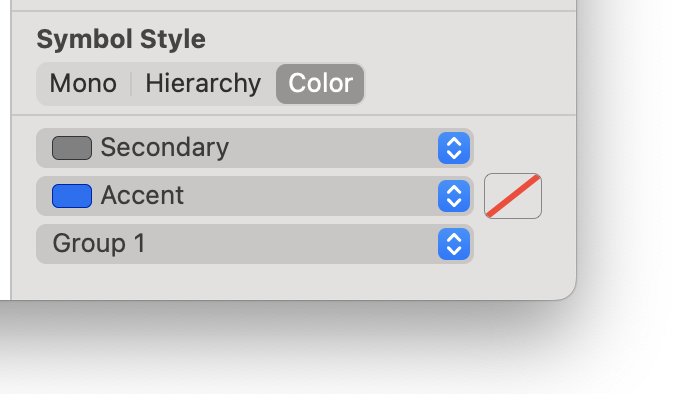
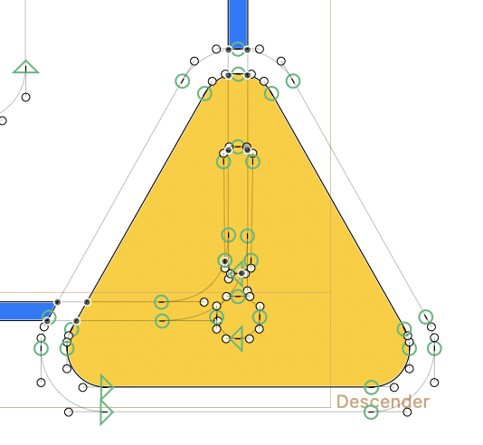

# SF Symbol Template
Plugin to create SF Symbol Template.

Go get started, export an Symbol (not a Template) from the SF-Symbol app. Then Import it into Glyphs with File > Import > Symbol Template … 

It supports most feature of SF-Symbols 6.

Use the "Symbol Style" selector to switch the color drawing more

And the three buttons to assign color and properties to selected paths.

### Known Issues:

When importing some symbols, some shapes are filled in. Select the exclamation paths, right click and do "Reverse Selected Contours".